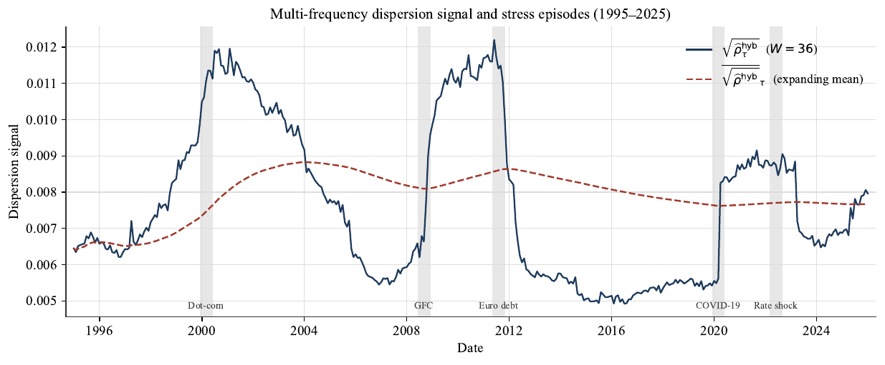
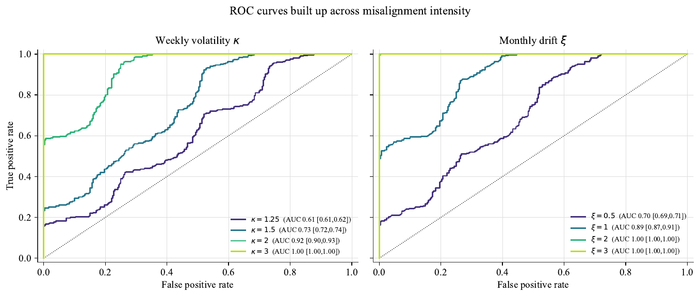
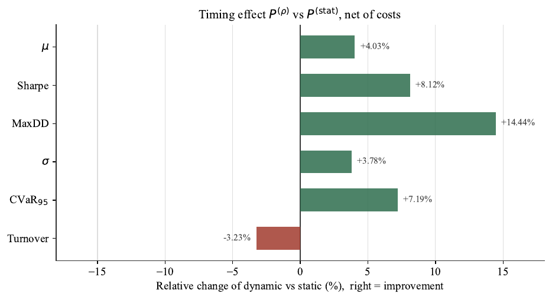
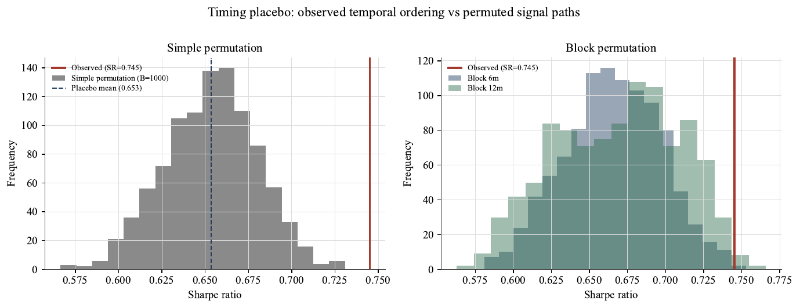

# MT-MFDRO

[](environment.yml)
[](LICENSE)
[](https://pypi.org/project/mfdro/)

Replication repository for my master's thesis **Distributionally Robust
Optimization: Endogenous Calibration of the Wasserstein Ambiguity Radius**,
submitted to HEC Lausanne, University of Lausanne.

[Read the complete thesis manuscript (PDF).](Manuscript.pdf)

## Abstract

My thesis examines whether the timing of the Wasserstein ambiguity radius can
be driven by observable information and have economic value distinct from its
average level. I construct a misalignment signal from daily, weekly, and
monthly return distributions, aggregate them around a Wasserstein barycenter,
and compare them using Sliced-Wasserstein distances. The signal modulates the
radius of a $W_2$ ambiguity set in a linear-loss portfolio problem, which I
evaluate through a point-in-time walk-forward design over 1995–2025. In the
main universe, I find that the net Sharpe ratio increases from 0.6892 to
0.7451, a gain of 0.0559. Neither the paired HAC test nor the paired bootstrap
establishes a general improvement at the 5% level. Signal-ordering placebos
reject the interchangeability of the observed temporal ordering, and the main
specification remains significant after max-$T$ adjustment within both the
four-cell and twelve-cell families. A modulation based on realized volatility
nevertheless achieves a slightly higher point estimate, without a significant
paired difference. My contribution is therefore primarily methodological: the
level and timing of the ambiguity radius can be distinguished and tested, but
the signal's incremental economic value has not been established.

## Selected results

The public notebooks are intentionally committed without cell outputs.
Notebooks 03--05 nevertheless run end to end in their default `public` mode:
they verify the identifier-free research-output bundle and materialize the
reported figures and tables without access to licensed security-level data.

<table>
  <tr>
    <td width="50%" align="center">
      <a href="artifacts/figures/signal/R_01_signal_overview.pdf"></a><br>
      <sub>Multi-frequency dispersion signal and dated stress episodes</sub>
    </td>
    <td width="50%" align="center">
      <a href="artifacts/figures/signal/R_04_roc_family.pdf"></a><br>
      <sub>Controlled-placebo discrimination across perturbation intensities</sub>
    </td>
  </tr>
  <tr>
    <td width="50%" align="center">
      <a href="artifacts/figures/portfolio/R_P_03_relative_gain.pdf"></a><br>
      <sub>Economic effect of dynamic versus static robust allocation</sub>
    </td>
    <td width="50%" align="center">
      <a href="artifacts/figures/portfolio/R_P_04_placebo_timing.pdf"></a><br>
      <sub>Observed timing against simple and block-permutation nulls</sub>
    </td>
  </tr>
</table>

Browse the complete [figure collection](artifacts/figures/), the
[LaTeX tables](artifacts/tables/), the documented
[research-output bundle](artifacts/data/), or verify every released artifact
against [`artifacts/SHA256SUMS`](artifacts/SHA256SUMS).

## Repository scope

This repository contains the empirical pipeline used in my thesis:

- reconstruction of the delisting-adjusted CRSP daily panel;
- point-in-time CRSP CIZ common-stock eligibility;
- construction of the large-cap and NYSE small–mid-cap universes;
- estimation and validation of the multi-frequency signal;
- static and dynamically modulated DRO portfolio backtests;
- statistical inference, robustness exercises, and publication figures;
- a signed and resumable bundle for the long-running permutation and max-$T$
  experiment.

The reusable signal implementation is maintained separately as the
[`mfdro`](https://pypi.org/project/mfdro/) Python package:

```bash
python -m pip install mfdro
```

The package provides a parameterized public API for constructing the signal.
It does not reproduce the CRSP universes, portfolio engine, or inference
reported in my thesis, and it is not required to execute this repository.

## Repository layout

```text
mt-mfdro/
├── README.md
├── Manuscript.pdf                # complete master's thesis
├── DATA_ACCESS.md
├── CITATION.cff
├── LICENSE
├── environment.yml
├── artifacts/                     # figures, tables, and public research outputs
├── data/RAW_DATA_PS/             # publishable processing code only
├── notebooks/                    # empirical pipeline, steps 00--05
├── src/                          # active shared inference code
├── tests/                        # validation notebooks, steps 00--04
└── reproducibility/
    └── portfolio_timing_tests/   # signed permutation/max-T experiment
```

Licensed source data, internal caches, security-level audit ledgers, local logs,
and non-public generated artifacts are deliberately excluded from version
control. A curated identifier-free research-output bundle is released under
`artifacts/data/`; it is not an internal cache or a substitute for CRSP access.

## Environment

Create the reference environment from the repository root:

```bash
conda env create -f environment.yml
conda activate mthesis
python -m ipykernel install --user --name mthesis --display-name "Python (mthesis)"
```

The full portfolio workflow uses MOSEK through CVXPY. Installing the Python
package does not provide a MOSEK license; users selecting `full` mode must
supply a valid local academic or commercial license. Public mode does not solve
the portfolio problem. The signed long-run experiment must not be executed with
a silent solver fallback.

## Restricted data

The empirical pipeline relies on licensed CRSP/WRDS data. These data and all
security-level derivatives are **not distributed** in this repository. Users
must obtain their own authorized access and reconstruct the required local
files.

The raw-data reconstruction contract is documented in
[`data/RAW_DATA_PS/README.md`](data/RAW_DATA_PS/README.md). The additional
restricted inputs required by the timing experiment are documented in
[`reproducibility/portfolio_timing_tests/DATA_ACCESS.md`](reproducibility/portfolio_timing_tests/DATA_ACCESS.md).

The public repository contains processing code, schemas, cryptographic digests,
publication-safe figures and tables, and identifier-free research results. In
particular, it does not contain CRSP source returns, PERMNO-level holdings,
portfolio weight ledgers, or the private timing input bundle.

## Execution modes for notebooks 03--05

The three result-facing notebooks expose one explicit switch at the beginning:

```python
RUN_MODE = "public"  # or set MFDRO_RUN_MODE=full
```

- `public` is the default. It verifies `artifacts/SHA256SUMS`, validates the
  released aggregate paths and inference files, and writes the checked figures
  and tables under `outputs/public/`. It never reads licensed security-level
  inputs.
- `full` executes the original empirical workflow. It requires the locally
  reconstructed CRSP inputs, local caches where available, and a valid MOSEK
  license.

There is no silent fallback between modes. Public mode reproduces and verifies
the released research outputs; only full mode rebuilds them from security-level
observations.

After creating the environment and registering the `mthesis` kernel, the public
path can be checked non-interactively with:

```bash
mkdir -p /tmp/mt-mfdro-public-run
for notebook in \
  notebooks/03_R_Signal.ipynb \
  notebooks/04_R_Portfolio.ipynb \
  notebooks/05_generate_methodology_appendix_figures.ipynb
do
  jupyter nbconvert \
    --to notebook --execute "$notebook" \
    --ExecutePreprocessor.kernel_name=mthesis \
    --ExecutePreprocessor.timeout=300 \
    --output-dir=/tmp/mt-mfdro-public-run
done
```

Each notebook must finish with `PUBLIC MODE PASS`.

## Notebook execution order

Run the notebooks from the repository root and preserve the following order:

| Step | Run | Then validate |
|---:|---|---|
| 0 | [Common-stock source](notebooks/00_build_common_stock_source.ipynb) | [Source guard](tests/00_assert_common_stock_source.ipynb) |
| 1 | [Point-in-time universes](notebooks/01_build_pit_big_small_caps.ipynb) | [Universe guard](tests/01_assert_pit_big_small_caps.ipynb) |
| 2 | [Point-in-time signals](notebooks/02_compute_pit_signals.ipynb) | [Signal publication guard](tests/02_validate_and_publish_pit_signals.ipynb) |
| 3 | [Signal results](notebooks/03_R_Signal.ipynb), public or full mode | [Signal-results guard](tests/03_assert_signal_validation.ipynb) |
| 4 | [Portfolio results](notebooks/04_R_Portfolio.ipynb), public or full mode | [Portfolio-results guard](tests/04_assert_portfolio_validation.ipynb) |
| 5 | [Methodology figures](notebooks/05_generate_methodology_appendix_figures.ipynb), public or full mode | — |

Steps 0–2 reconstruct the eligible universes and signals; steps 3–4 produce
the empirical results; step 5 generates the data-free methodological figures.

The delisting-adjusted source used before step 0 is reconstructed by
`data/RAW_DATA_PS/01_crsp+del_processing.ipynb`. Its reference mode requires a
private CRSP-derived ledger that cannot be redistributed. Its seeded mode
provides a deterministic SHA-256-based construction for authorized users who
do not possess that ledger.

Public copies of all notebooks are intentionally committed without cell
outputs. Execute the matching validation notebook immediately after each full
empirical stage rather than only at the end of the pipeline. In public mode,
notebooks 03--05 validate the frozen release and materialize checked outputs
under `outputs/public/`. Final publication-safe outputs are versioned under
[`artifacts/`](artifacts/).

## Long-running timing experiment

The permutation and family-wise max-$T$ calculations are isolated under
[`reproducibility/portfolio_timing_tests/`](reproducibility/portfolio_timing_tests/).
This bundle reproduces the shared $B=1{,}000$ draw panel used in Sections
6.2.4 and 6.2.8.1 of
[`04_R_Portfolio.ipynb`](notebooks/04_R_Portfolio.ipynb). It is not limited to
the twelve-cell max-$T$ result: one signed experiment produces three linked
inferential levels:

1. chronological placebos for the main large-cap portfolio, using simple
   monthly, six-month-block, and twelve-month-block rearrangements;
2. the primary max-$T_4$ correction across the four universe--sample cells
   `L_all`, `L_exdc`, `S_all`, and `S_exdc`;
3. the more conservative max-$T_{12}$ diagnostic, which enlarges the
   within-draw family while retaining the same joint monthly permutations.

The block rearrangements belong only to the first level; the two max-$T$
families use the simple monthly resampling law. Within each monthly draw, the
same rearrangement is shared across universes so that cross-cell dependence is
retained before taking the row-wise family maximum. In my thesis outputs,
Level 1 feeds Figure P_04 and Table P_02, while Levels 2 and 3 feed Figures
P_08--P_09 and Tables P_06--P_08.

The bundle also provides:

- a signed experiment manifest;
- cross-platform environment guards;
- resumable and checkpointed batches;
- status and merge utilities;
- SHA-256 verification of code and aggregate reference results.

Its [dedicated README](reproducibility/portfolio_timing_tests/README.md)
contains the exact smoke-test, batch, monitoring, and merge commands. The
restricted `timing_test_inputs.npz` file is rebuilt locally and never committed.

## Validation philosophy

The validation notebooks check more than successful execution. They verify
point-in-time membership, schemas, signed manifests, input and engine digests,
portfolio accounting identities, regression guards, permutation coverage,
exceedance counts, and exact row-wise max-$T$ reconstruction.

Reference results must never be combined across different input, experiment,
or engine digests. A methodological or data change defines a new experiment.

## Citation

If this repository contributes to academic work, please cite:

> Bakari, Abdul Kadir Jeylani (2026). *Distributionally Robust Optimization:
> Endogenous Calibration of the Wasserstein Ambiguity Radius*. Master's thesis,
> HEC Lausanne, University of Lausanne.

Machine-readable citation metadata are provided in [`CITATION.cff`](CITATION.cff).

## License and disclaimer

The source code is released under the [MIT License](LICENSE). This license does
not grant redistribution rights for CRSP/WRDS data, CBOE data, or any other
third-party dataset. My thesis manuscript and institutional marks are not
covered by the software license.

This repository is provided for research and reproducibility purposes. It is
not investment advice, and no warranty is made regarding investment or trading
outcomes.
